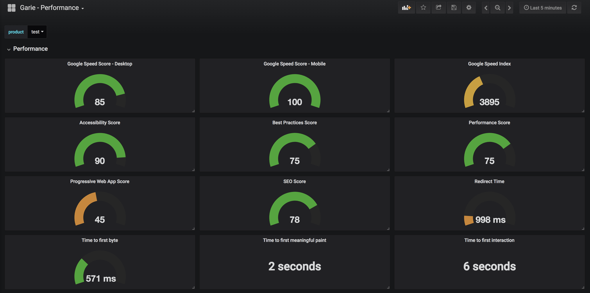
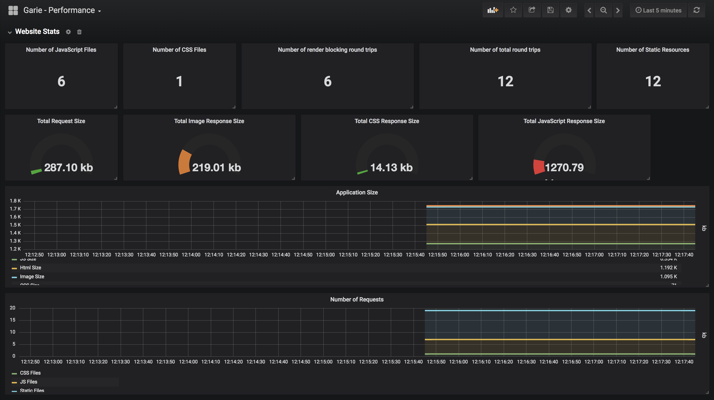
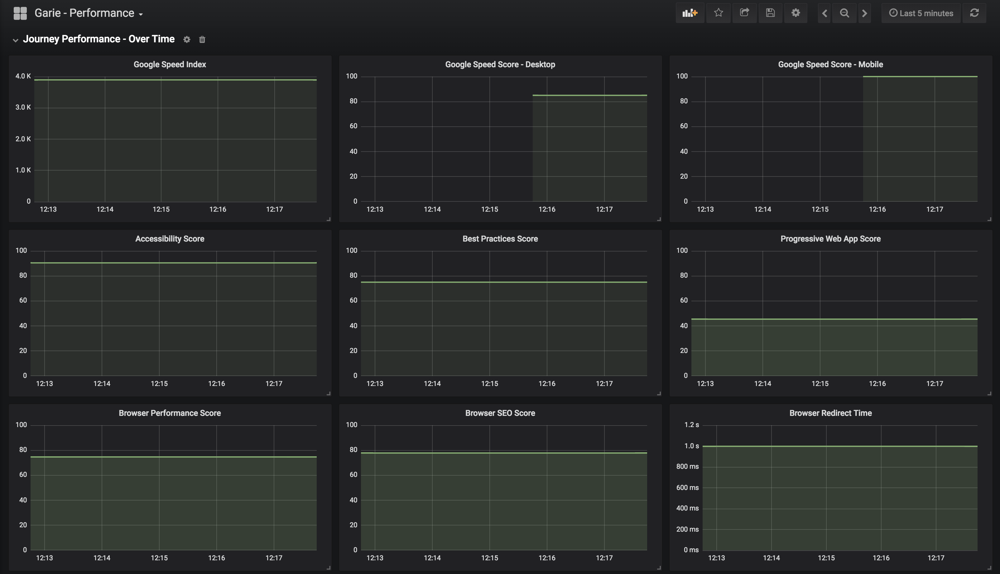

[](https://opensource.org/licenses/MIT)


Perfie is a open source tool for monitoring web performance using promethus and graphna. Perfie integrated with lighthouse, page speed insights and web page test to gather performance metrics then logs them into promethesus.

**Highlights**

* Setup everything with one command.
* Out the box dashboards.
* View performance data over time.
* Integrated with Lighthouse, Page-speed-insights & Web page test.

## Overview of Perfie

Perfie is a simple express server sat ontop of multiple docker containers to collect performance data through multiple performance tools. The data is stored in promethesus and visualised using Grafana.





### Prerequisites

- Docker and Node 8.10.0 or greater.
- [Page speed insights API key](https://developers.google.com/speed/docs/insights/v4/first-app)
- [Lighthouse API key](https://docs.google.com/forms/d/e/1FAIpQLSdIc3QNIMn7bBMgl2cfxmmo6wGBlUpdLGxjB_ml464t9eCg_A/viewform)

### Installing

```
PAGE_SPEED_INSIGHTS_KEY={PAGE_SPEED_INSIGHTS_KEY} LIGHTHOUSE_API_KEY={LIGHTHOUSE_API_KEY} docker-compose up
```

Once docker-compose has complete, go to [http://localhost](http://localhost) to view your dashboard that is already setup and good to go!

- username: admin
- password: secret

### Capturing data

You can capture data anyway you want. You could setup a cron job to hit the application every X amount of times to gather information or a github webhook with any release of your software.

#### Lighthouse

##### GET - `localhost:8080/lighthouse?url={url}&product={product}`

- url - The url to get the performance data for.
- product - The product which is used on the dashboards.

Example: `http://localhost:8080/lighthouse?url=http://www.google.co.uk&product=google`

#### Page speed insights

##### GET - `localhost:8080/page-speed-insights?url={url}&product={product}`

- url - The url to get the performance data for.
- product - The product which is used on the dashboards.

Example: `http://localhost:8080/page-speed-insights?url=http://www.google.co.uk&product=google`

### Viewing dashboards

You can view your dashboards at [http://localhost](http://localhost). You will be asked to login. Please use the credentials below.

- username: admin
- password: secret

### Avaiable Metrics

TODO: List all the metrics, where they come from and what they mean? in a table?

